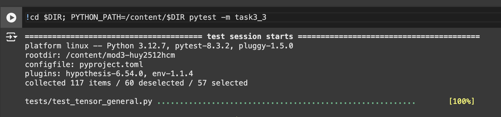
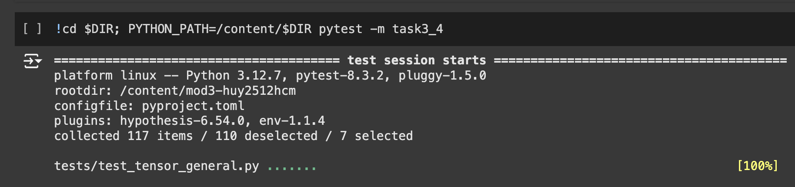

# MiniTorch Module 3


* Docs: https://minitorch.github.io/

* Overview: https://minitorch.github.io/module3.html


You will need to modify `tensor_functions.py` slightly in this assignment.

* Tests:

```
python run_tests.py
```

* Note:

Several of the tests for this assignment will only run if you are on a GPU machine and will not
run on github's test infrastructure. Please follow the instructions to setup up a colab machine
to run these tests.

This assignment requires the following files from the previous assignments. You can get these by running

```bash
python sync_previous_module.py previous-module-dir current-module-dir
```

The files that will be synced are:

        minitorch/tensor_data.py minitorch/tensor_functions.py minitorch/tensor_ops.py minitorch/operators.py minitorch/scalar.py minitorch/scalar_functions.py minitorch/module.py minitorch/autodiff.py minitorch/module.py project/run_manual.py project/run_scalar.py project/run_tensor.py minitorch/operators.py minitorch/module.py minitorch/autodiff.py minitorch/tensor.py minitorch/datasets.py minitorch/testing.py minitorch/optim.py


## 3.3


## 3.4



## 3.5

### CPU training:
### Split dataset
```
Epoch 0, loss 10.289469516995377, correct: 30, time per epoch: 5.3693
Epoch 10, loss 5.031957345395964, correct: 38, time per epoch: 0.0368
Epoch 20, loss 5.89184031051182, correct: 33, time per epoch: 0.0720
Epoch 30, loss 4.631885361748972, correct: 44, time per epoch: 0.0458
Epoch 40, loss 4.206116221591523, correct: 46, time per epoch: 0.0371
Epoch 50, loss 3.5499802695067952, correct: 48, time per epoch: 0.0530
Epoch 60, loss 3.8759258463405875, correct: 47, time per epoch: 0.0379
Epoch 70, loss 3.12639826404467, correct: 49, time per epoch: 0.0468
Epoch 80, loss 3.0799422136617656, correct: 50, time per epoch: 0.0509
Epoch 90, loss 1.4572889062927215, correct: 48, time per epoch: 0.0456
Epoch 100, loss 0.7698367205511172, correct: 50, time per epoch: 0.0417
Epoch 110, loss 1.046199615893143, correct: 49, time per epoch: 0.0346
Epoch 120, loss 1.510717865335551, correct: 49, time per epoch: 0.0414
Epoch 130, loss 1.5283198867181722, correct: 49, time per epoch: 0.0522
Epoch 140, loss 0.6476999867952332, correct: 49, time per epoch: 0.0363
Epoch 150, loss 0.4810521756729189, correct: 49, time per epoch: 0.0438
Epoch 160, loss 0.8504424968364447, correct: 50, time per epoch: 0.0375
Epoch 170, loss 1.089566701648757, correct: 49, time per epoch: 0.0480
Epoch 180, loss 0.4336270111210374, correct: 49, time per epoch: 0.0463
Epoch 190, loss 0.6334761589238697, correct: 50, time per epoch: 0.0374
Epoch 200, loss 0.6948827112131767, correct: 50, time per epoch: 0.0352
Epoch 210, loss 0.15145115662908173, correct: 50, time per epoch: 0.0378
Epoch 220, loss 0.31722201404611666, correct: 50, time per epoch: 0.0370
Epoch 230, loss 0.2847669975371973, correct: 50, time per epoch: 0.0368
Epoch 240, loss 0.5235272060633566, correct: 50, time per epoch: 0.0382
Epoch 250, loss 0.20041190066187536, correct: 50, time per epoch: 0.0538
Epoch 260, loss 0.8943314701302763, correct: 50, time per epoch: 0.0407
Epoch 270, loss 0.7486501315964362, correct: 50, time per epoch: 0.0543
Epoch 280, loss 0.5991793437136015, correct: 50, time per epoch: 0.0437
Epoch 290, loss 0.5947334692116348, correct: 50, time per epoch: 0.0415
Epoch 300, loss 0.24523089893763972, correct: 50, time per epoch: 0.0379
Epoch 310, loss 0.34166634027598974, correct: 50, time per epoch: 0.0377
Epoch 320, loss 0.11941046004219812, correct: 50, time per epoch: 0.0433
Epoch 330, loss 0.8233522498274796, correct: 50, time per epoch: 0.0344
Epoch 340, loss 0.29299540943613883, correct: 50, time per epoch: 0.0353
Epoch 350, loss 0.24417377851679575, correct: 50, time per epoch: 0.0351
Epoch 360, loss 0.07305979399306003, correct: 50, time per epoch: 0.0354
Epoch 370, loss 0.5142877322274906, correct: 50, time per epoch: 0.0350
Epoch 380, loss 0.18838279936701247, correct: 50, time per epoch: 0.0494
Epoch 390, loss 0.12938346405044504, correct: 50, time per epoch: 0.0415
Epoch 400, loss 0.15280321141279754, correct: 50, time per epoch: 0.0426
Epoch 410, loss 0.19573884426072505, correct: 50, time per epoch: 0.0347
Epoch 420, loss 0.19962676679856245, correct: 50, time per epoch: 0.0355
Epoch 430, loss 0.14623368513663249, correct: 50, time per epoch: 0.0347
Epoch 440, loss 0.05152056277070397, correct: 50, time per epoch: 0.0347
Epoch 450, loss 0.17047146683552683, correct: 50, time per epoch: 0.0382
Epoch 460, loss 0.09675522767989639, correct: 50, time per epoch: 0.0348
Epoch 470, loss 0.13639243584199837, correct: 50, time per epoch: 0.0358
Epoch 480, loss 0.4051027456691444, correct: 50, time per epoch: 0.0352
Epoch 490, loss 0.03159528513117277, correct: 50, time per epoch: 0.0368
```


### Simple dataset
```
Epoch 0, loss 7.494596172336729, correct: 39, time per epoch: 5.2344
Epoch 10, loss 1.8109582840616874, correct: 49, time per epoch: 0.0401
Epoch 20, loss 1.290551288472741, correct: 50, time per epoch: 0.0420
Epoch 30, loss 0.30558930011720314, correct: 50, time per epoch: 0.0455
Epoch 40, loss 1.0252034081700099, correct: 50, time per epoch: 0.0363
Epoch 50, loss 0.8849560085213465, correct: 50, time per epoch: 0.0387
Epoch 60, loss 0.28489036237580323, correct: 50, time per epoch: 0.0357
Epoch 70, loss 0.0789983175091564, correct: 50, time per epoch: 0.0342
Epoch 80, loss 0.366108141806776, correct: 50, time per epoch: 0.0401
Epoch 90, loss 0.1849116046732382, correct: 50, time per epoch: 0.0376
Epoch 100, loss 0.02257669232216092, correct: 50, time per epoch: 0.0345
Epoch 110, loss 0.2621672693013866, correct: 50, time per epoch: 0.0382
Epoch 120, loss 0.5118024859239897, correct: 50, time per epoch: 0.0356
Epoch 130, loss 0.6771554874676363, correct: 50, time per epoch: 0.0375
Epoch 140, loss 0.051189330184327406, correct: 50, time per epoch: 0.0663
Epoch 150, loss 0.1328429887800764, correct: 50, time per epoch: 0.0397
Epoch 160, loss 0.06991623763608223, correct: 50, time per epoch: 0.0359
Epoch 170, loss 0.05605556387525999, correct: 50, time per epoch: 0.0390
Epoch 180, loss 0.029798136985655446, correct: 50, time per epoch: 0.0395
Epoch 190, loss 0.07158376724458752, correct: 50, time per epoch: 0.0367
Epoch 200, loss 0.4772760267131647, correct: 50, time per epoch: 0.0358
Epoch 210, loss 0.40329905781266306, correct: 50, time per epoch: 0.0362
Epoch 220, loss 0.02126728241687128, correct: 50, time per epoch: 0.0361
Epoch 230, loss 0.4402151581603323, correct: 50, time per epoch: 0.0374
Epoch 240, loss 0.3529212474457773, correct: 50, time per epoch: 0.0358
Epoch 250, loss 0.3442059999673986, correct: 50, time per epoch: 0.0388
Epoch 260, loss 0.04494344601103375, correct: 50, time per epoch: 0.0368
Epoch 270, loss 0.3130102703357568, correct: 50, time per epoch: 0.0473
Epoch 280, loss 0.2472083380644449, correct: 50, time per epoch: 0.0416
Epoch 290, loss 0.3055796666814829, correct: 50, time per epoch: 0.0416
Epoch 300, loss 0.014938973274831907, correct: 50, time per epoch: 0.0352
Epoch 310, loss 0.08388140956914776, correct: 50, time per epoch: 0.0403
Epoch 320, loss 0.07369557884792613, correct: 50, time per epoch: 0.0348
Epoch 330, loss 0.2570868433476638, correct: 50, time per epoch: 0.0338
Epoch 340, loss 0.04258006355356205, correct: 50, time per epoch: 0.0357
Epoch 350, loss 0.23317402655087535, correct: 50, time per epoch: 0.0355
Epoch 360, loss 0.21086464211961284, correct: 50, time per epoch: 0.0368
Epoch 370, loss 0.011090401005887719, correct: 50, time per epoch: 0.0357
Epoch 380, loss 0.3086799238456637, correct: 50, time per epoch: 0.0349
Epoch 390, loss 0.029386861269727508, correct: 50, time per epoch: 0.0380
Epoch 400, loss 0.05271875758776935, correct: 50, time per epoch: 0.0397
Epoch 410, loss 0.14097912344974545, correct: 50, time per epoch: 0.0391
Epoch 420, loss 0.1203712309048373, correct: 50, time per epoch: 0.0370
Epoch 430, loss 0.008016176696996235, correct: 50, time per epoch: 0.0351
Epoch 440, loss 0.04569629145952677, correct: 50, time per epoch: 0.0368
Epoch 450, loss 0.02002615397069076, correct: 50, time per epoch: 0.0342
Epoch 460, loss 0.004607467153478163, correct: 50, time per epoch: 0.0341
Epoch 470, loss 0.23307280835873315, correct: 50, time per epoch: 0.0361
Epoch 480, loss 0.012102496691143438, correct: 50, time per epoch: 0.0359
Epoch 490, loss 0.18294142666882152, correct: 50, time per epoch: 0.0356
```

### XOR dataset
```
Epoch 0, loss 7.423457021005917, correct: 31, time per epoch: 5.4589
Epoch 10, loss 4.316630071015956, correct: 48, time per epoch: 0.0706
Epoch 20, loss 3.1504258704411905, correct: 49, time per epoch: 0.0640
Epoch 30, loss 3.201647089768343, correct: 48, time per epoch: 0.0650
Epoch 40, loss 2.1468222173518705, correct: 49, time per epoch: 0.0582
Epoch 50, loss 3.283346880273613, correct: 48, time per epoch: 0.0526
Epoch 60, loss 1.2923083483204527, correct: 49, time per epoch: 0.0489
Epoch 70, loss 1.2123547161037205, correct: 49, time per epoch: 0.0544
Epoch 80, loss 1.3339616922306876, correct: 49, time per epoch: 0.0577
Epoch 90, loss 0.8230137600944752, correct: 49, time per epoch: 0.0509
Epoch 100, loss 2.247596258968017, correct: 49, time per epoch: 0.0446
Epoch 110, loss 1.9410369569345252, correct: 49, time per epoch: 0.0500
Epoch 120, loss 1.085739165605145, correct: 49, time per epoch: 0.0499
Epoch 130, loss 0.3385520449855312, correct: 49, time per epoch: 0.0481
Epoch 140, loss 0.8487182633992383, correct: 49, time per epoch: 0.0414
Epoch 150, loss 0.7611538470327518, correct: 50, time per epoch: 0.0509
Epoch 160, loss 1.549177817274765, correct: 49, time per epoch: 0.0409
Epoch 170, loss 1.0852090760082023, correct: 49, time per epoch: 0.0449
Epoch 180, loss 0.5910429451136654, correct: 49, time per epoch: 0.0459
Epoch 190, loss 0.19580810261973736, correct: 49, time per epoch: 0.0475
Epoch 200, loss 0.5413841810944345, correct: 49, time per epoch: 0.0423
Epoch 210, loss 0.23751401746303852, correct: 49, time per epoch: 0.0489
Epoch 220, loss 1.006325306981922, correct: 49, time per epoch: 0.0629
Epoch 230, loss 0.24078710538288475, correct: 49, time per epoch: 0.0413
Epoch 240, loss 0.32969840220433644, correct: 49, time per epoch: 0.0424
Epoch 250, loss 1.8341673607952593, correct: 50, time per epoch: 0.0384
Epoch 260, loss 0.35532248480351897, correct: 49, time per epoch: 0.0444
Epoch 270, loss 1.2915572708147318, correct: 49, time per epoch: 0.0463
Epoch 280, loss 1.0701703212678186, correct: 49, time per epoch: 0.0430
Epoch 290, loss 1.7835062319325636, correct: 49, time per epoch: 0.0544
Epoch 300, loss 0.5097120729176627, correct: 50, time per epoch: 0.0493
Epoch 310, loss 0.04548589396300872, correct: 49, time per epoch: 0.0396
Epoch 320, loss 0.477272551291192, correct: 50, time per epoch: 0.0478
Epoch 330, loss 0.3507007757802324, correct: 49, time per epoch: 0.0544
Epoch 340, loss 0.03391530010055361, correct: 49, time per epoch: 0.0468
Epoch 350, loss 0.6550347532324855, correct: 49, time per epoch: 0.0421
Epoch 360, loss 0.44107622352747816, correct: 49, time per epoch: 0.0446
Epoch 370, loss 1.2763597835219327, correct: 49, time per epoch: 0.0457
Epoch 380, loss 0.0868159199326655, correct: 49, time per epoch: 0.0399
Epoch 390, loss 0.15410764654306566, correct: 50, time per epoch: 0.0433
Epoch 400, loss 0.12875421866102052, correct: 49, time per epoch: 0.0505
Epoch 410, loss 0.28367344040593373, correct: 49, time per epoch: 0.0490
Epoch 420, loss 1.2333188571509976, correct: 49, time per epoch: 0.0380
Epoch 430, loss 0.23057546995332143, correct: 49, time per epoch: 0.0407
Epoch 440, loss 0.35629248936413493, correct: 49, time per epoch: 0.0502
Epoch 450, loss 0.3195707280567095, correct: 49, time per epoch: 0.0395
Epoch 460, loss 0.2233336137831534, correct: 49, time per epoch: 0.0410
Epoch 470, loss 0.1561512641714936, correct: 49, time per epoch: 0.0485
Epoch 480, loss 0.12173814805482824, correct: 50, time per epoch: 0.0492
Epoch 490, loss 1.1460430439086582, correct: 49, time per epoch: 0.0394
```

### GPU training:
### Simple
```
Epoch 0, loss 4.528885434128814, correct: 45, time per epoch: 3.2977
Epoch 10, loss 1.1189468548858947, correct: 49, time per epoch: 2.0522
Epoch 20, loss 0.97633260381307, correct: 50, time per epoch: 1.6943
Epoch 30, loss 0.36938187338816, correct: 50, time per epoch: 1.6742
Epoch 40, loss 1.2559887619678531, correct: 50, time per epoch: 1.7730
Epoch 50, loss 0.3234202206354537, correct: 50, time per epoch: 1.7838
Epoch 60, loss 0.45066394375166996, correct: 50, time per epoch: 1.6733
Epoch 70, loss 0.316255183870802, correct: 50, time per epoch: 2.1244
Epoch 80, loss 0.10971174671670275, correct: 50, time per epoch: 1.6744
Epoch 90, loss 0.06923978666231365, correct: 50, time per epoch: 2.3871
Epoch 100, loss 0.1687782347987848, correct: 50, time per epoch: 1.6847
Epoch 110, loss 0.015701231688519546, correct: 50, time per epoch: 2.5060
Epoch 120, loss 0.534062005576653, correct: 50, time per epoch: 1.6684
Epoch 130, loss 0.5250421457049558, correct: 50, time per epoch: 2.2037
Epoch 140, loss 0.1503513925219916, correct: 50, time per epoch: 1.6820
Epoch 150, loss 0.2626917984673267, correct: 50, time per epoch: 2.0277
Epoch 160, loss 0.05855574847425666, correct: 50, time per epoch: 1.6928
Epoch 170, loss 0.04392933008779683, correct: 50, time per epoch: 2.3350
Epoch 180, loss 0.127242514848103, correct: 50, time per epoch: 1.6863
Epoch 190, loss 0.0398971233622298, correct: 50, time per epoch: 2.0561
Epoch 200, loss 0.5879659213576528, correct: 50, time per epoch: 1.6598
Epoch 210, loss 0.474683477722204, correct: 50, time per epoch: 1.8077
Epoch 220, loss 0.052776397846939424, correct: 50, time per epoch: 1.6741
Epoch 230, loss 0.023904704740353687, correct: 50, time per epoch: 1.6780
Epoch 240, loss 0.02523123827936419, correct: 50, time per epoch: 1.6860
Epoch 250, loss 0.026908293966109838, correct: 50, time per epoch: 1.6724
Epoch 260, loss 0.44329980900463445, correct: 50, time per epoch: 1.6942
Epoch 270, loss 0.05956202446463415, correct: 50, time per epoch: 1.6953
Epoch 280, loss 0.5419747030389732, correct: 50, time per epoch: 1.6782
Epoch 290, loss 0.014588646928236089, correct: 50, time per epoch: 1.7595
Epoch 300, loss 0.39907228855019733, correct: 50, time per epoch: 1.6958
Epoch 310, loss 0.41794425615979075, correct: 50, time per epoch: 1.6843
Epoch 320, loss 0.038018425853932766, correct: 50, time per epoch: 1.7017
Epoch 330, loss 0.12422610337016618, correct: 50, time per epoch: 1.6648
Epoch 340, loss 0.32267450392252056, correct: 50, time per epoch: 1.6660
Epoch 350, loss 0.018873255145076772, correct: 50, time per epoch: 1.7409
Epoch 360, loss 0.0014405147623792174, correct: 50, time per epoch: 1.6823
Epoch 370, loss 0.37190257842404595, correct: 50, time per epoch: 1.7288
Epoch 380, loss 0.31863834600953433, correct: 50, time per epoch: 1.6795
Epoch 390, loss 0.002033743743836973, correct: 50, time per epoch: 1.6821
Epoch 400, loss 0.013814110687360222, correct: 50, time per epoch: 1.6842
Epoch 410, loss 0.26349458729021963, correct: 50, time per epoch: 1.6760
Epoch 420, loss 0.2681863575162881, correct: 50, time per epoch: 1.6816
Epoch 430, loss 0.37874125237374245, correct: 50, time per epoch: 1.6595
Epoch 440, loss 0.0009862401424175352, correct: 50, time per epoch: 1.6890
Epoch 450, loss 0.0010332187279870494, correct: 50, time per epoch: 1.6666
Epoch 460, loss 0.0033691735873571395, correct: 50, time per epoch: 1.6941
Epoch 470, loss 2.009494531349e-05, correct: 50, time per epoch: 1.7039
Epoch 480, loss 0.059455989583618654, correct: 50, time per epoch: 2.0640
Epoch 490, loss 0.0009905569676755118, correct: 50, time per epoch: 1.7004
```

### Split
```
Epoch 0, loss 6.897202343938298, correct: 25, time per epoch: 3.3860
Epoch 10, loss 5.815931975403564, correct: 42, time per epoch: 1.6844
Epoch 20, loss 4.459062833311458, correct: 39, time per epoch: 1.6927
Epoch 30, loss 3.2576032473238, correct: 43, time per epoch: 1.6874
Epoch 40, loss 3.005508714295349, correct: 44, time per epoch: 1.7508
Epoch 50, loss 3.3408828521622933, correct: 45, time per epoch: 1.6745
Epoch 60, loss 2.4696815604110385, correct: 49, time per epoch: 1.6754
Epoch 70, loss 2.273148933080542, correct: 46, time per epoch: 1.6724
Epoch 80, loss 2.2972320515405085, correct: 45, time per epoch: 1.7106
Epoch 90, loss 2.0003387056173607, correct: 46, time per epoch: 1.6867
Epoch 100, loss 2.521076155465477, correct: 48, time per epoch: 1.6727
Epoch 110, loss 1.6142393475128274, correct: 49, time per epoch: 1.6722
Epoch 120, loss 2.286449486312484, correct: 48, time per epoch: 1.7423
Epoch 130, loss 1.9193335809730436, correct: 49, time per epoch: 1.6801
Epoch 140, loss 4.340680242981691, correct: 44, time per epoch: 2.0167
Epoch 150, loss 0.908743910102736, correct: 50, time per epoch: 1.6785
Epoch 160, loss 2.307009021966124, correct: 44, time per epoch: 2.2446
Epoch 170, loss 0.17967840571868654, correct: 50, time per epoch: 1.7301
Epoch 180, loss 2.109423399870265, correct: 46, time per epoch: 2.4196
Epoch 190, loss 0.5283931293101894, correct: 47, time per epoch: 1.6616
Epoch 200, loss 1.6352991419386083, correct: 49, time per epoch: 2.4704
Epoch 210, loss 0.4615061366339198, correct: 46, time per epoch: 1.6867
Epoch 220, loss 2.0504140804585576, correct: 46, time per epoch: 2.1528
Epoch 230, loss 3.1419675132529874, correct: 42, time per epoch: 1.6747
Epoch 240, loss 1.7750449210496448, correct: 50, time per epoch: 1.8734
Epoch 250, loss 0.5771292841999481, correct: 48, time per epoch: 1.6719
Epoch 260, loss 1.5162730418768122, correct: 46, time per epoch: 1.7295
Epoch 270, loss 1.1215708087264646, correct: 49, time per epoch: 1.6741
Epoch 280, loss 5.257219773356508, correct: 49, time per epoch: 1.6729
Epoch 290, loss 0.8576372754838939, correct: 48, time per epoch: 1.7624
Epoch 300, loss 1.5543201821187533, correct: 49, time per epoch: 1.6716
Epoch 310, loss 3.119246970641314, correct: 45, time per epoch: 1.6886
Epoch 320, loss 0.26677834497958397, correct: 49, time per epoch: 1.6739
Epoch 330, loss 0.5434361530305555, correct: 47, time per epoch: 1.6926
Epoch 340, loss 0.31772890773809603, correct: 48, time per epoch: 1.6846
Epoch 350, loss 1.775978112835659, correct: 48, time per epoch: 1.8661
Epoch 360, loss 1.5410864046129769, correct: 50, time per epoch: 1.7331
Epoch 370, loss 1.6492396676406607, correct: 49, time per epoch: 1.7682
Epoch 380, loss 1.4223921553859082, correct: 48, time per epoch: 1.6663
Epoch 390, loss 0.8500904708682401, correct: 49, time per epoch: 2.0232
Epoch 400, loss 1.276524752004572, correct: 49, time per epoch: 1.6783
Epoch 410, loss 1.3774043490609391, correct: 48, time per epoch: 2.4125
Epoch 420, loss 0.9014135632040917, correct: 47, time per epoch: 1.6707
Epoch 430, loss 0.3600757143478458, correct: 49, time per epoch: 2.5043
Epoch 440, loss 0.8978334728149234, correct: 50, time per epoch: 1.6700
Epoch 450, loss 1.2607909993171884, correct: 47, time per epoch: 2.2947
Epoch 460, loss 1.0378212289006699, correct: 50, time per epoch: 1.6885
Epoch 470, loss 0.05984713692771274, correct: 50, time per epoch: 1.9235
Epoch 480, loss 1.0653674905592192, correct: 50, time per epoch: 1.7409
Epoch 490, loss 0.44842381301614, correct: 49, time per epoch: 1.6770
```

### XOR dataset
```
Epoch 0, loss 5.118059471363061, correct: 33, time per epoch: 3.3956
Epoch 10, loss 5.649072959229536, correct: 39, time per epoch: 1.6927
Epoch 20, loss 4.842708365257408, correct: 40, time per epoch: 1.6725
Epoch 30, loss 2.955112366919362, correct: 39, time per epoch: 1.6917
Epoch 40, loss 3.6898419526839614, correct: 44, time per epoch: 1.7685
Epoch 50, loss 5.918944705265609, correct: 44, time per epoch: 1.6916
Epoch 60, loss 3.277389823649279, correct: 41, time per epoch: 1.6725
Epoch 70, loss 2.2532184438559537, correct: 44, time per epoch: 1.6812
Epoch 80, loss 2.641937408886137, correct: 45, time per epoch: 1.6905
Epoch 90, loss 2.5699414189881047, correct: 46, time per epoch: 1.7323
Epoch 100, loss 2.9865339883804904, correct: 45, time per epoch: 1.6874
Epoch 110, loss 1.8418506766031912, correct: 45, time per epoch: 1.7239
Epoch 120, loss 3.971330191135216, correct: 46, time per epoch: 1.7023
Epoch 130, loss 3.5018755089628897, correct: 46, time per epoch: 1.6884
Epoch 140, loss 1.2396652798505592, correct: 48, time per epoch: 1.6792
Epoch 150, loss 2.3910346982557416, correct: 48, time per epoch: 1.7093
Epoch 160, loss 1.198829607179963, correct: 48, time per epoch: 1.7373
Epoch 170, loss 2.2266167205799166, correct: 47, time per epoch: 1.8034
Epoch 180, loss 1.9921187041219464, correct: 48, time per epoch: 1.6935
Epoch 190, loss 1.8721666130796892, correct: 49, time per epoch: 1.8170
Epoch 200, loss 1.2071714466494157, correct: 47, time per epoch: 1.6841
Epoch 210, loss 0.4148088707608317, correct: 45, time per epoch: 1.9927
Epoch 220, loss 1.091343270473107, correct: 50, time per epoch: 1.6960
Epoch 230, loss 1.5125125152440306, correct: 48, time per epoch: 1.9831
Epoch 240, loss 3.249332135011539, correct: 46, time per epoch: 1.6948
Epoch 250, loss 1.1557682258624484, correct: 48, time per epoch: 1.9972
Epoch 260, loss 1.338634094587827, correct: 50, time per epoch: 1.7358
Epoch 270, loss 1.1498518972549123, correct: 47, time per epoch: 2.0165
Epoch 280, loss 0.6364481703833282, correct: 49, time per epoch: 1.6820
Epoch 290, loss 1.3849725157049377, correct: 49, time per epoch: 2.2062
Epoch 300, loss 2.57669741089636, correct: 47, time per epoch: 1.6741
Epoch 310, loss 0.9489741965771643, correct: 47, time per epoch: 1.7298
Epoch 320, loss 0.20067023361974717, correct: 48, time per epoch: 1.6833
Epoch 330, loss 1.3558383614776914, correct: 49, time per epoch: 1.8892
Epoch 340, loss 0.8026093241266987, correct: 48, time per epoch: 1.6937
Epoch 350, loss 1.0407999372111212, correct: 50, time per epoch: 2.1060
Epoch 360, loss 1.5380738966565, correct: 48, time per epoch: 1.6870
Epoch 370, loss 0.4387466301302618, correct: 50, time per epoch: 2.1619
Epoch 380, loss 1.1594103648727083, correct: 48, time per epoch: 1.6860
Epoch 390, loss 0.48980608920886803, correct: 50, time per epoch: 2.3679
Epoch 400, loss 1.1412436388248015, correct: 50, time per epoch: 1.6746
Epoch 410, loss 0.6096726041591993, correct: 48, time per epoch: 2.4950
Epoch 420, loss 1.0589916410401639, correct: 48, time per epoch: 1.6792
Epoch 430, loss 0.9194354847121049, correct: 50, time per epoch: 2.5188
Epoch 440, loss 0.7070251188775278, correct: 50, time per epoch: 1.6828
Epoch 450, loss 1.326854454597812, correct: 49, time per epoch: 2.8703
Epoch 460, loss 2.1229152946666003, correct: 48, time per epoch: 1.6581
Epoch 470, loss 0.8153309224347987, correct: 50, time per epoch: 1.8580
Epoch 480, loss 1.0975814873169503, correct: 50, time per epoch: 1.7574
Epoch 490, loss 1.047935490290241, correct: 50, time per epoch: 1.7446
```

### Bigger dataset (Hidden = 250)
### XOR CPU
```
(.venv) (base) HuyHoang@dhcp-vl2051-1552 project % python run_fast_tensor.py --BACKEND cpu --HIDDEN 250 --DATASET xor --RATE 0.05
```

```
Epoch 0, loss 12.38549874737842, correct: 26, time per epoch: 4.3553
Epoch 10, loss 4.512304729627964, correct: 44, time per epoch: 0.1671
Epoch 20, loss 5.427120838725631, correct: 43, time per epoch: 0.1654
Epoch 30, loss 1.5466078997757577, correct: 45, time per epoch: 0.1694
Epoch 40, loss 3.9442749261338763, correct: 46, time per epoch: 0.1650
Epoch 50, loss 2.12782804333441, correct: 45, time per epoch: 0.1653
Epoch 60, loss 2.1231533948719417, correct: 47, time per epoch: 0.1684
Epoch 70, loss 2.6819928811071265, correct: 46, time per epoch: 0.1641
Epoch 80, loss 2.8791593154125983, correct: 47, time per epoch: 0.1681
Epoch 90, loss 1.4300477298002614, correct: 46, time per epoch: 0.1783
Epoch 100, loss 0.4409060686101051, correct: 46, time per epoch: 0.1654
Epoch 110, loss 4.873801990347338, correct: 46, time per epoch: 0.1627
Epoch 120, loss 0.6485551843719737, correct: 49, time per epoch: 0.1643
Epoch 130, loss 1.4250558285981552, correct: 48, time per epoch: 0.1684
Epoch 140, loss 1.07888246725133, correct: 47, time per epoch: 0.1699
Epoch 150, loss 0.9011421397438173, correct: 48, time per epoch: 0.1658
Epoch 160, loss 1.944973655847422, correct: 49, time per epoch: 0.2046
Epoch 170, loss 3.2727076117659584, correct: 46, time per epoch: 0.1830
Epoch 180, loss 0.5082949351773532, correct: 48, time per epoch: 0.1637
Epoch 190, loss 1.5294273755185315, correct: 47, time per epoch: 0.1768
Epoch 200, loss 1.6501389287563861, correct: 48, time per epoch: 0.1737
Epoch 210, loss 0.7414037071983908, correct: 50, time per epoch: 0.1712
Epoch 220, loss 1.054509127262357, correct: 49, time per epoch: 0.1776
Epoch 230, loss 1.1109485567248896, correct: 47, time per epoch: 0.1676
Epoch 240, loss 1.1328906780375387, correct: 50, time per epoch: 0.1682
Epoch 250, loss 0.2830540761154451, correct: 50, time per epoch: 0.1764
Epoch 260, loss 1.5780597302394566, correct: 49, time per epoch: 0.1672
Epoch 270, loss 1.1166270129322209, correct: 49, time per epoch: 0.1636
Epoch 280, loss 0.576892529363005, correct: 49, time per epoch: 0.1771
Epoch 290, loss 3.2422839960690504, correct: 50, time per epoch: 0.1681
Epoch 300, loss 1.4802789331190227, correct: 49, time per epoch: 0.1630
Epoch 310, loss 1.047646192745545, correct: 49, time per epoch: 0.1685
Epoch 320, loss 0.6101268708868551, correct: 49, time per epoch: 0.1621
Epoch 330, loss 0.13292379272912516, correct: 50, time per epoch: 0.1691
Epoch 340, loss 1.236121549164599, correct: 49, time per epoch: 0.1760
Epoch 350, loss 0.07470209490964318, correct: 47, time per epoch: 0.1639
Epoch 360, loss 0.5676165396823071, correct: 48, time per epoch: 0.1759
Epoch 370, loss 0.09628533967696397, correct: 49, time per epoch: 0.1657
Epoch 380, loss 0.528294863565026, correct: 49, time per epoch: 0.1631
Epoch 390, loss 0.9225904499948575, correct: 50, time per epoch: 0.1613
Epoch 400, loss 0.5760722854471425, correct: 49, time per epoch: 0.2629
Epoch 410, loss 0.10999568647381044, correct: 50, time per epoch: 0.1657
Epoch 420, loss 1.2252308205504594, correct: 50, time per epoch: 0.1811
Epoch 430, loss 1.15992450425967, correct: 49, time per epoch: 0.1806
Epoch 440, loss 0.7207257482227438, correct: 49, time per epoch: 0.1722
Epoch 450, loss 0.572986542003397, correct: 50, time per epoch: 0.1771
Epoch 460, loss 1.7192416697017334, correct: 48, time per epoch: 0.2245
Epoch 470, loss 2.7514479591849366, correct: 49, time per epoch: 0.1801
Epoch 480, loss 0.5323164139915844, correct: 50, time per epoch: 0.1838
Epoch 490, loss 0.6795297345858137, correct: 49, time per epoch: 0.1824
```

### XOR GPU
```
!cd $DIR; PYTHONPATH=/content/$DIR python project/run_fast_tensor.py --BACKEND gpu --HIDDEN 250 --DATASET xor --RATE 0.05
```

```
Epoch 0, loss 47.576039472203604, correct: 25, time per epoch: 3.5149
Epoch 10, loss 3.6857003912489743, correct: 45, time per epoch: 1.8254
Epoch 20, loss 2.9635094104660187, correct: 44, time per epoch: 1.8080
Epoch 30, loss 2.993076484782236, correct: 42, time per epoch: 1.7916
Epoch 40, loss 4.092055122217499, correct: 45, time per epoch: 2.3478
Epoch 50, loss 1.7653159723692622, correct: 46, time per epoch: 1.8112
Epoch 60, loss 3.2297577552200853, correct: 47, time per epoch: 1.9505
Epoch 70, loss 1.2200441359314598, correct: 47, time per epoch: 1.8151
Epoch 80, loss 0.6119132905770032, correct: 48, time per epoch: 1.7978
Epoch 90, loss 0.32618756833937923, correct: 49, time per epoch: 2.1746
Epoch 100, loss 1.2802947127486195, correct: 47, time per epoch: 1.7884
Epoch 110, loss 2.3120902677902495, correct: 49, time per epoch: 1.8128
Epoch 120, loss 0.35468874350675433, correct: 48, time per epoch: 1.7948
Epoch 130, loss 0.22733750137066616, correct: 48, time per epoch: 1.7861
Epoch 140, loss 1.2568144025804695, correct: 49, time per epoch: 2.2956
Epoch 150, loss 1.6613304004142697, correct: 49, time per epoch: 1.8391
Epoch 160, loss 0.9167959390098062, correct: 50, time per epoch: 1.9409
Epoch 170, loss 0.8909737767211297, correct: 50, time per epoch: 1.8692
Epoch 180, loss 0.6850151031536102, correct: 49, time per epoch: 1.8158
Epoch 190, loss 0.975759394600442, correct: 50, time per epoch: 2.0857
Epoch 200, loss 0.9423118381455641, correct: 49, time per epoch: 1.7828
Epoch 210, loss 0.49254884932313053, correct: 50, time per epoch: 2.3299
Epoch 220, loss 0.5556768041060016, correct: 50, time per epoch: 1.7892
Epoch 230, loss 1.2638799573633999, correct: 49, time per epoch: 1.8007
Epoch 240, loss 0.48844957190989435, correct: 49, time per epoch: 1.8431
Epoch 250, loss 0.5003428401131889, correct: 50, time per epoch: 1.7993
Epoch 260, loss 1.7712396218912876, correct: 49, time per epoch: 2.4976
Epoch 270, loss 0.2852490875515028, correct: 49, time per epoch: 1.8049
Epoch 280, loss 0.04057795405684401, correct: 50, time per epoch: 1.8426
Epoch 290, loss 1.0228311795965992, correct: 50, time per epoch: 1.8689
Epoch 300, loss 0.23269644113177873, correct: 49, time per epoch: 1.8054
Epoch 310, loss 0.03581557348458529, correct: 50, time per epoch: 2.1866
Epoch 320, loss 0.25849407737782415, correct: 49, time per epoch: 1.7992
Epoch 330, loss 0.6027841906097227, correct: 50, time per epoch: 2.1935
Epoch 340, loss 0.17336838839772573, correct: 50, time per epoch: 1.7832
Epoch 350, loss 0.25417371451711157, correct: 50, time per epoch: 1.8685
Epoch 360, loss 0.12772193180948485, correct: 50, time per epoch: 1.8434
Epoch 370, loss 0.03353670596380326, correct: 50, time per epoch: 1.7862
Epoch 380, loss 0.8345860508053166, correct: 50, time per epoch: 2.0896
Epoch 390, loss 0.47503712968185574, correct: 50, time per epoch: 1.8157
Epoch 400, loss 0.8429658598743451, correct: 50, time per epoch: 1.8063
Epoch 410, loss 0.988628869950092, correct: 50, time per epoch: 1.8023
Epoch 420, loss 0.1725050538347407, correct: 50, time per epoch: 1.7830
Epoch 430, loss 0.15038930285280222, correct: 50, time per epoch: 2.4878
Epoch 440, loss 0.02221361535861072, correct: 50, time per epoch: 1.8262
Epoch 450, loss 0.499302444323178, correct: 50, time per epoch: 1.7813
Epoch 460, loss 0.3419913165065951, correct: 50, time per epoch: 1.7956
Epoch 470, loss 0.6525924819580422, correct: 50, time per epoch: 1.7777
Epoch 480, loss 0.24720283688867659, correct: 50, time per epoch: 2.4124
Epoch 490, loss 0.273975922329583, correct: 50, time per epoch: 1.8003
```